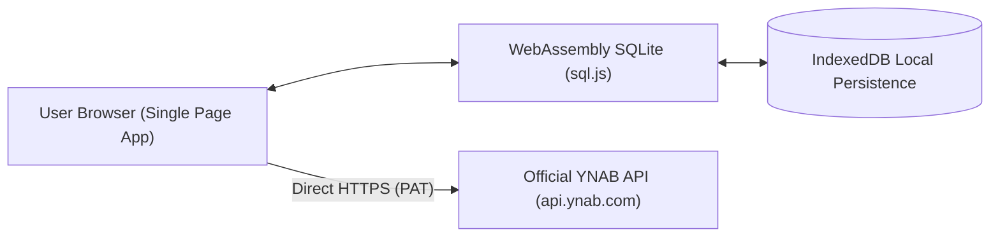

# YNAB Intelligence Suite ⚡

An enterprise-grade, zero-backend, client-side personal finance intelligence dashboard powered by the official [YNAB (You Need a Budget)](https://www.ynab.com/) REST API, in-browser WebAssembly SQLite (`sql.js`), and Apache ECharts.


-purple.svg)

---

## 🌟 Highlights

- **Zero-Setup Client Execution**: No `npm install`, no `node_modules`, no webpack/vite build steps. Pure standard modern ES modules and verified CDN assets. Open `index.html` directly or serve with any static web server (`npx serve .` or `python3 -m http.server`).
- **In-Browser Relational SQLite (WebAssembly)**: Runs full SQLite 3 inside your browser via WebAssembly (`sql.js`). All budgets, accounts, categories, and transactions are indexed and relational.
- **Persistent IndexedDB Storage**: Database snapshots automatically persist across page reloads in your browser's private `IndexedDB`.
- **Smart Delta Sync (`server_knowledge`)**: Uses YNAB's `last_knowledge_of_server` mechanism to only pull incremental updates. Routine visits require **0 or 1** API request, keeping you well under the 200 requests/hour YNAB rate limit.
- **Interactive Financial Visualizations (Apache ECharts)**:
  - **Multi-Tier Sankey Diagram**: Funds flow from Income &rarr; Master Category Groups &rarr; Top Sub-Categories &rarr; Net Savings.
  - **365-Day Spending Velocity Heatmap**: GitHub-style calendar heatmap showing daily expenditure intensity.
  - **Payee Pareto Analysis (80/20 Rule)**: Combines bar charts and cumulative percentage lines to pinpoint the payees responsible for 80% of your expenses.
  - **Burn Rate Speedometer**: Live gauge comparing current month outflows against 3-month, 6-month, and 12-month rolling averages.
  - **Historical Net Worth Stacked Area**: Asset growth stacked against liability obligations over time.
- **Pacing & Health Telemetry**:
  - **Day-of-Month Pacing Indicators**: Visual Green/Amber/Red badges comparing spending against the elapsed time in the month.
  - **Sinking Fund Target Health**: Tracks funding progress towards deadlines and computes underfunded contributions.
  - **Debt Payoff Engine**: Interactive Snowball (lowest balance first) vs. Avalanche (highest APR first) payoff schedules with extra monthly payment simulations.
- **Transaction Explorer & Universal Search**:
  - Filter transactions by Payee, Category, Account, Date range, and Type with instant client-side response.
  - One-click CSV export directly from your browser.
- **Subscriptions & Behavioral Telemetry**:
  - Automatically identifies repeating monthly subscriptions, utilities, and memberships with annualized cost estimates.
  - Day-of-week spending heatmaps and month-over-month category variance analysis.
- **Dynamic Timeframe & Month Filter**:
  - Flexible timeframe filtering (Current Month, Last Month, 3M, 6M, 12M, YTD, All Time, or any specific historical month).
- **Security & Privacy First**: Your YNAB Personal Access Token (PAT) and financial data never leave your browser. All API requests go directly to `api.ynab.com`.

---

## 🚀 Quick Start (Zero Build Required)

### Option 1: Instant Local HTTP Server (Recommended)

Clone the repository and run any static file server:

```bash
git clone https://github.com/danielwaugh/ynab_tracker.git
cd ynab_tracker

# Using Python 3:
python3 -m http.server 8080

# Or using Node.js npx:
npx serve .
```

Open `http://localhost:8080` in your browser.

### Option 2: Direct File Execution

Double-click `index.html` to open it directly in your browser. 
*(Note: If connecting live with a PAT over `file://`, enable the "CORS Proxy Bridge" in Settings if your browser restricts `Origin: null` cross-origin requests).*

---

## 🔑 Connecting Your YNAB Account

1. Generate a **Personal Access Token (PAT)** from your [YNAB Account Developer Settings](https://app.ynab.com/settings/developer).
2. Click **API Key & Settings** in the dashboard sidebar or modal.
3. Paste your token and click **Save & Connect**.
4. Select your desired budget from the top navigation dropdown.
5. The application will pull your full budget snapshot, store it in SQLite WebAssembly, and persist it to IndexedDB for instantaneous loading on future visits.

---

## 📊 Feature Walkthrough

### 1. Executive Dashboard (Home View)
- **Age of Money (AoM)**: Days between when money was earned and when it was spent.
- **Total Net Worth & Liquid Cash**: Instant asset and liability summaries with runway projection.
- **Rolling Burn Rate & Runway**: Calculates months of survival based on 3M, 6M, and 12M moving averages.
- **Quick Alerts Center**: Overspent categories, unapproved transactions, and accounts needing reconciliation (>14 days).

### 2. Category Intelligence & Pacing Tracker
- **Dynamic Day-of-Month Pacing**: Tells you if you are spending faster than days are passing.
- **Category Group Drill-Downs**: Expandable tables comparing Assigned, Activity, and Available funds.
- **Sinking Fund Targets**: Tracks progress bars, deadlines, and monthly required funding gaps.

### 3. Advanced Cash Flow & Spending
- **Multi-Tier Sankey Diagram**: Full visual map of where your income went.
- **Calendar Heatmap**: Identifies seasonal and weekend spending velocity spikes.
- **Payee Pareto Analysis**: Visualizes your top vendors and the 80% spending threshold.
- **Monthly Inflow vs. Outflow**: Stacked bar comparison with cumulative net savings trajectory.

### 4. Net Worth & Debt Payoff Engine
- **Assets vs. Liabilities Area Chart**: Long-term trajectory of wealth creation.
- **Account Class Distribution**: Donut breakdown of liquid cash, savings, investments, and debt.
- **Debt Snowball vs. Avalanche Simulator**: Test different extra monthly payment amounts ($100, $250, $500) to compare payoff dates and interest saved between both strategies.

### 5. Transactions Intelligence Hub
- **Universal Search**: Real-time filtering across payees, categories, and transaction memos.
- **Multi-Dimension Filters**: Filter by Account, Category, Date range, and Inflow vs. Outflow types.
- **Live Summary Metrics**: Instant calculations of Filtered Records, Total Inflows, Total Outflows, and Net Movement.
- **One-Click CSV Export**: Export any filtered query dataset directly to `.csv` in your browser.

### 6. Spending Trends & Recurring Subscriptions
- **Recurring Merchant Detection**: Automatically identifies repeat subscriptions and recurring bills (streaming, utilities, memberships, insurance) with monthly average spend and annualized projections.
- **Day-of-Week Behavioral Heatmap**: Analyzes which days of the week experience the highest expenditures.
- **Month-over-Month Category Drift**: Interactive divergence chart tracking spending increases vs. savings between any two months in budget history.

---

## 🔒 Privacy & Architecture



- **Client-Side Only**: There is no custom backend, no analytics tracker, and no intermediary database.
- **Direct HTTPS**: Communication occurs strictly between your browser and `https://api.ynab.com/v1/`.
- **Private Storage**: Tokens and data reside solely in your browser's `localStorage` and `IndexedDB`.

---

## 🛠️ Technology Stack

| Layer | Technology |
| :--- | :--- |
| **Language & Runtime** | Vanilla ES Modules (HTML5 / CSS3 / ES2022) |
| **Styling & Theme** | Tailwind CSS Play CDN + Custom Glassmorphism CSS Tokens |
| **Database Engine** | SQL.js (SQLite 3 compiled to WebAssembly) |
| **Data Persistence** | Native Browser IndexedDB |
| **Visualizations** | Apache ECharts 5.5 |
| **Iconography** | Lucide Icons |

---

## 📄 License

Distributed under the MIT License. See `LICENSE` for more information.